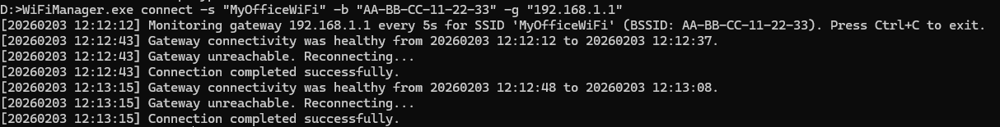

# WiFiManager

[中文](#简介) | [English](#introduction)

---

## Introduction

**WiFiManager** is a lightweight command-line tool for Windows designed to manage Wi-Fi connections. It provides robust monitoring and auto-reconnection capabilities, making it ideal for maintaining stable connections on unattended devices or servers. It also features a powerful scanner that can list detailed BSSID information.

Built with .NET 8 and utilizes the Native Windows WLAN API.

### Key Features

*   **Connection Monitoring**: Continuously pings a gateway and automatically reconnects if the connection drops.
*   **BSSID Locking**: Can target a specific Access Point (BSSID), useful for troubleshooting roaming issues or connecting to a specific node in a mesh network.
*   **Detailed Scanning**:
    *   **Network Mode**: Summarizes available networks by SSID.
    *   **BSSID Mode**: Lists every visible AP with details like Frequency, RSSI, Link Quality, PHY type, and Band (2.4GHz/5GHz/6GHz).
*   **Single File**: Compiled as a self-contained, single-file executable for easy deployment.

## Usage

### 1. Connect & Monitor

Monitor connectivity to a gateway and reconnect to a specific WiFi network if it fails.

```powershell
# Basic usage
WiFiManager.exe connect --ssid "MyWiFi" --gateway 192.168.1.1 --password "topsecret" 
# Note: Password handling might depend on profile existence; this tool mainly triggers connection to existing profiles or open networks.
# Based on code, it uses existing profiles matching the SSID.

# Connect to a specific BSSID (MAC Address)
WiFiManager.exe connect --ssid "MyWiFi" --bssid "12:34:56:78:90:AB" --gateway 192.168.1.1

# Specify interface by name or GUID
WiFiManager.exe connect --ssid "MyWiFi" --gateway 192.168.1.1 --interface "Intel(R) Wi-Fi"
```

**Options:**

*   `-s, --ssid`: (Required after merging config + CLI) The SSID of the Wi-Fi network.
*   `-b, --bssid`: (Optional) The specific BSSID (MAC address) to connect to.
*   `-g, --gateway`: (Required after merging config + CLI) The IP address of the gateway to ping for connectivity checks.
*   `-i, --interval`: (Optional) Ping interval in seconds (default: 5).
*   `-c, --config`: (Optional) Path to a JSON configuration file.
*   `-n, --interface`: (Optional) Target Wi-Fi interface (GUID or name substring). Defaults to the first interface.

### 2. Scan Networks

List available Wi-Fi networks.

```powershell
# Summary view (default)
WiFiManager.exe scan

# Detailed BSSID view
WiFiManager.exe scan --mode bssid

# Scan using a specific interface
WiFiManager.exe scan --mode bssid --interface "Intel(R) Wi-Fi"
```

**Options:**

*   `-m, --mode`: Scan mode. `network` (default) or `bssid`.
*   `-n, --interface`: (Optional) Target Wi-Fi interface (GUID or name substring). Defaults to the first interface.

### 3. Show Interfaces

List all Wi-Fi interfaces and their states:

```powershell
WiFiManager.exe show interface
```

### Configuration File

You can use a JSON file instead of command-line arguments:

`config.json`:
```json
{
  "SSID": "MyWiFi",
  "BSSID": "aa:bb:cc:dd:ee:ff",
  "Gateway": "192.168.1.1",
  "Interval": 10
}
```

Run with config:
```powershell
WiFiManager.exe connect --config ./config.json
```

## Screenshots

> scan


> connect



## Build

Requirements: .NET 8 SDK

```powershell
dotnet publish -c Release
```

The executable will be in `bin/Release/net8.0/win-x64/publish/`.

## License

Released under the [MIT License](LICENSE).

## Run as a Windows Service (WinSW)

Use [WinSW](https://github.com/winsw/winsw) to run WiFiManager in the background as a Windows service.

### 1. Prepare files

Put the following files in the same folder, e.g. `C:\WiFiManager\`:

* `WiFiManager.exe`
* `config.json` (optional config file for this tool)
* `winsw.xml` (WinSW config, example below)
* `winsw.exe` (download the WinSW binary and rename it to `WiFiManager.exe` **or** keep `winsw.exe` and use `winsw.xml`)

> Note: The WinSW wrapper executable name should match the XML name (e.g., `winsw.exe` + `winsw.xml`). 

### 2. WinSW configuration

Example `winsw.xml`:

```xml
<service>
  <id>WiFiManager</id>
  <name>WiFiManager</name>
  <description>WiFiManager background service</description>
  <executable>WiFiManager.exe</executable>
  <arguments>connect -c config.json</arguments>
  <log mode="roll-by-size">
    <sizeThreshold>10240</sizeThreshold>
    <keepFiles>8</keepFiles>
  </log>
  <onfailure action="restart" delay="10 sec"/>
</service>
```

### 3. Install and start service

Run in an elevated PowerShell:

```powershell
cd C:\WiFiManager\
.\winsw.exe install
.\winsw.exe start
```

### 4. Stop and uninstall

```powershell
.\winsw.exe stop
.\winsw.exe uninstall
```

Logs are stored in the same directory by default (rolling logs).

---

## 简介

**WiFiManager** 是一个轻量级的 Windows 命令行工具，专为管理 Wi-Fi 连接设计。它提供了强大的连接监控和自动断线重连功能，非常适合在无人值守的设备或服务器上维护稳定的网络连接。此外，它还包含一个强大的扫描器，可以列出详细的 BSSID 信息。

基于 .NET 8 构建，直接调用原生 Windows WLAN API。

### 主要功能

*   **连接监控**：持续 Ping 指定网关，一旦检测到掉线即自动尝试重连。
*   **BSSID 锁定**：可以指定连接到特定的接入点（BSSID），这在排查漫游问题或连接到 Mesh 网络中的特定节点时非常有用。
*   **详细扫描**：
    *   **网络模式**：按 SSID 汇总可用网络。
    *   **BSSID 模式**：列出每个可见的 AP 详细信息，包括频率、RSSI、链路质量、PHY 类型和频段（2.4GHz/5GHz/6GHz）。
*   **单文件**：编译为自包含的单文件可执行程序，无需安装运行时，便于部署。

## 使用说明

### 1. 连接与监控

监控到网关的连通性，并在失败时重连到指定的 Wi-Fi。

```powershell
# 基本用法
WiFiManager.exe connect --ssid "MyWiFi" --gateway 192.168.1.1

# 注意：该工具主要利用 Windows 中已保存的配置文件进行连接。

# 连接到特定 BSSID (MAC 地址)
WiFiManager.exe connect --ssid "MyWiFi" --bssid "12:34:56:78:90:AB" --gateway 192.168.1.1

# 指定网卡接口（名称或 GUID）
WiFiManager.exe connect --ssid "MyWiFi" --gateway 192.168.1.1 --interface "Intel(R) Wi-Fi"
```

**参数：**

*   `-s, --ssid`: （合并配置文件与命令行参数后必填）Wi-Fi 名称 (SSID)。
*   `-b, --bssid`: (选填) 要连接的特定 BSSID (MAC 地址)。
*   `-g, --gateway`: （合并配置文件与命令行参数后必填）用于检测连通性的网关 IP 地址。
*   `-i, --interval`: (选填) Ping 检测间隔，单位秒 (默认: 5)。
*   `-c, --config`: (选填) JSON 配置文件路径。
*   `-n, --interface`: (选填) 目标 Wi-Fi 网卡（GUID 或名称关键字）。默认使用首个无线网卡。

### 2. 扫描网络

列出当前环境可用的 Wi-Fi 网络。

```powershell
# 摘要视图 (默认)
WiFiManager.exe scan

# 详细 BSSID 视图
WiFiManager.exe scan --mode bssid

# 使用指定网卡进行扫描
WiFiManager.exe scan --mode bssid --interface "Intel(R) Wi-Fi"
```

**参数：**

*   `-m, --mode`: 扫描模式。`network` (默认，按网络汇总) 或 `bssid` (列出所有物理接入点)。
*   `-n, --interface`: (选填) 目标 Wi-Fi 网卡（GUID 或名称关键字）。默认使用首个无线网卡。

### 3. 显示网卡信息

列出所有无线网卡及其当前状态：

```powershell
WiFiManager.exe show interface
```

### 配置文件

你可以使用 JSON 文件来替代命令行参数：

`config.json`:
```json
{
  "SSID": "MyWiFi",
  "BSSID": "aa:bb:cc:dd:ee:ff",
  "Gateway": "192.168.1.1",
  "Interval": 10
}
```

使用配置运行：
```powershell
WiFiManager.exe connect --config ./config.json
```

## 效果截图

> scan


> connect


## 构建

环境要求：.NET 8 SDK

```powershell
dotnet publish -c Release
```

生成的可执行文件位于 `bin/Release/net8.0/win-x64/publish/`。

## 许可证

基于 [MIT License](LICENSE) 发布。

## 后台服务（WinSW）

使用 [WinSW](https://github.com/winsw/winsw) 将 WiFiManager 作为 Windows 服务后台守护运行。

### 1. 准备文件

将以下文件放到同一目录，例如 `C:\WiFiManager\`：

* `WiFiManager.exe`
* `config.json`（可选，工具配置文件）
* `winsw.exe`
* `winsw.xml`（WinSW 配置，示例见下）

> 注意：WinSW 包装程序的可执行文件名需要与 XML 名称一致（如 `winsw.exe` + `winsw.xml`）。

### 2. WinSW 配置

`winsw.xml` 示例：

```xml
<service>
  <id>WiFiManager</id>
  <name>WiFiManager</name>
  <description>WiFiManager background service</description>
  <executable>WiFiManager.exe</executable>
  <arguments>connect -c config.json</arguments>
  <log mode="roll-by-size">
    <sizeThreshold>10240</sizeThreshold>
    <keepFiles>8</keepFiles>
  </log>
  <onfailure action="restart" delay="10 sec"/>
</service>
```

### 3. 安装并启动服务

使用管理员 PowerShell：

```powershell
cd C:\WiFiManager\
.\winsw.exe install
.\winsw.exe start
```

### 4. 停止并卸载

```powershell
.\winsw.exe stop
.\winsw.exe uninstall
```

默认日志保存在同目录（滚动日志）。
